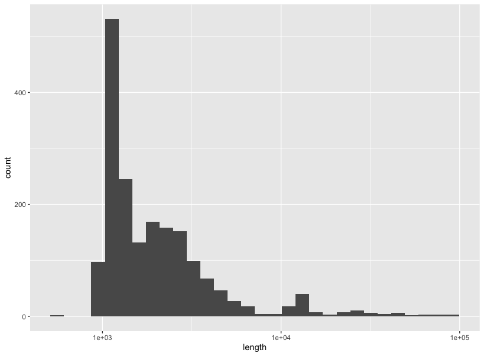
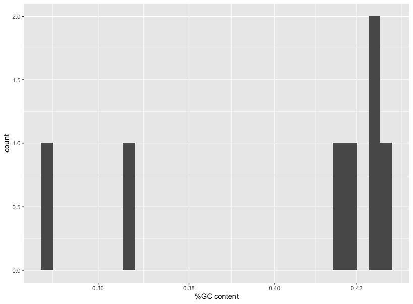
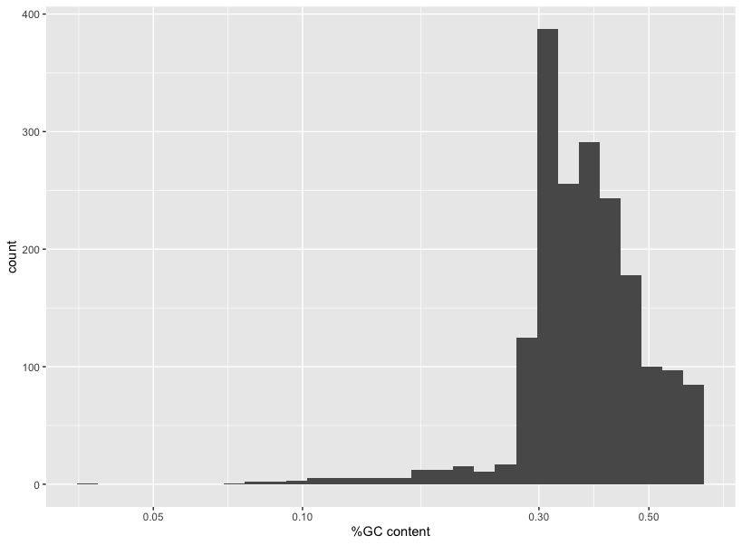
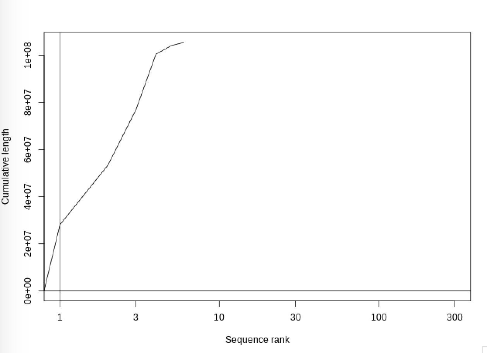
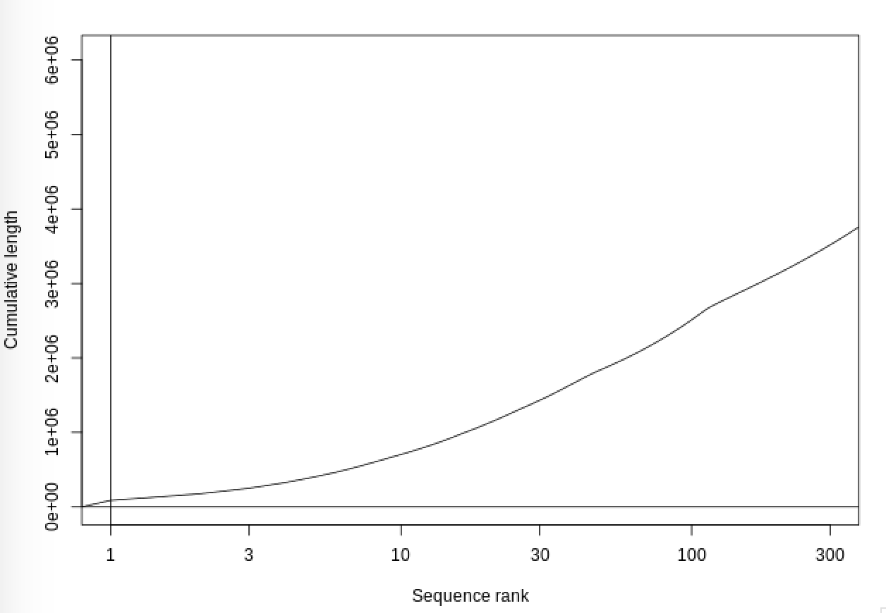
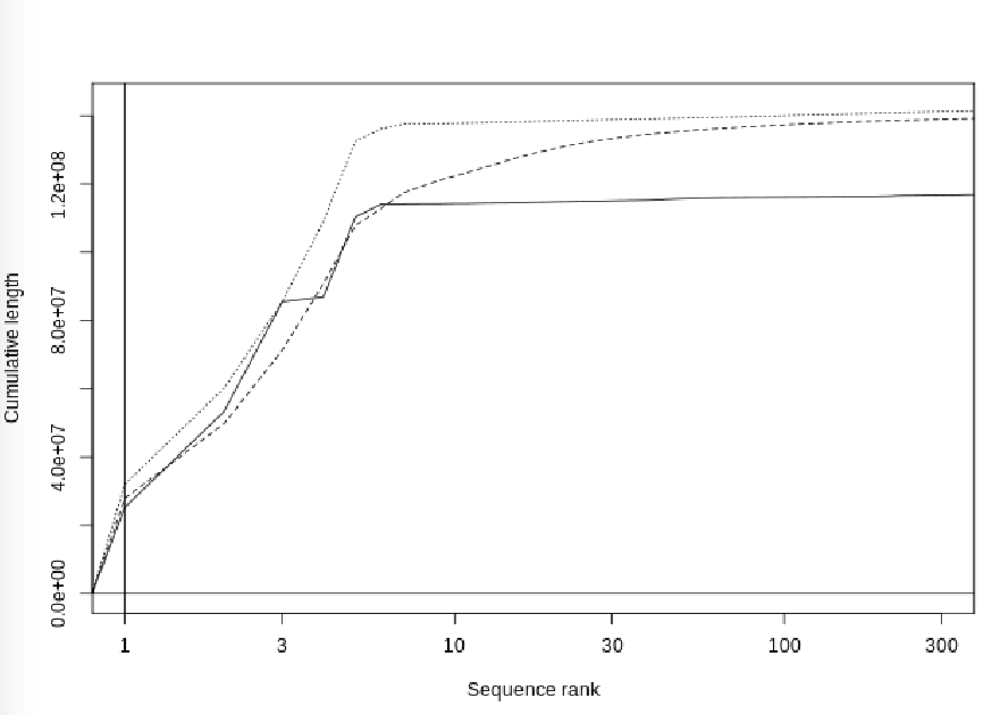
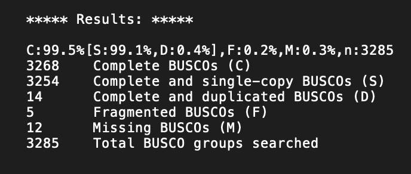
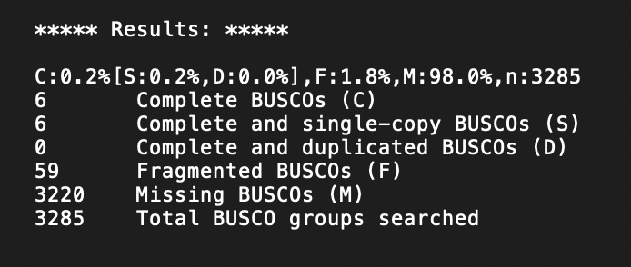
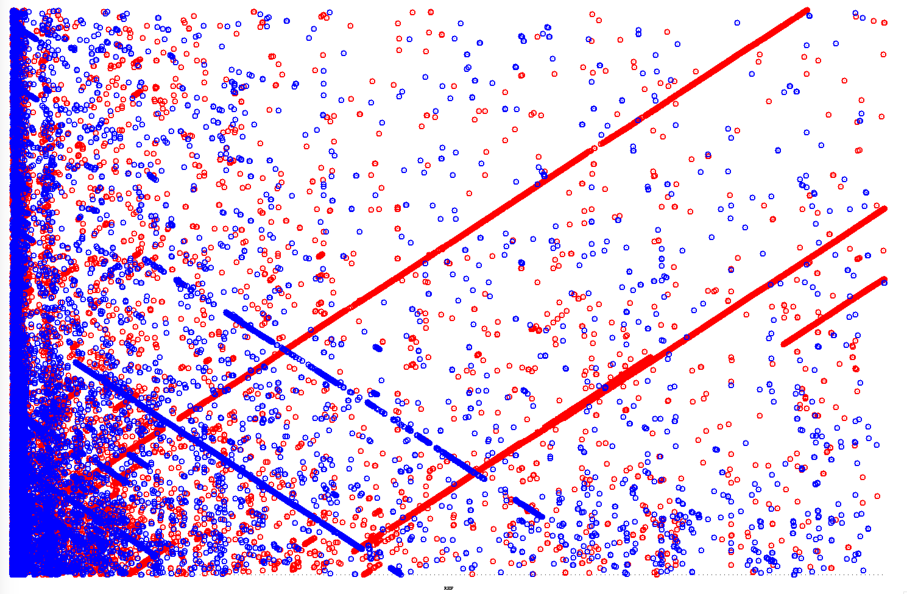

# Homework 4

Ria Deshpande \
December 11, 2020

## Summarize partitions of a genome assembly

Download the data from flybase, and the md5sum file to confirm the integrity of the file.
``` bash
wget ftp://ftp.flybase.net/genomes/dmel/current/fasta/dmel-all-chromosome-r6.36.fasta.gz
wget ftp://ftp.flybase.net/genomes/dmel/current/fasta/md5sum.txt
md5sum -c md5sum.txt
```
Identify the sizes of the different sequences in the fasta file. Sort the file by size, in descending order with the largest sequence at the top, and the shortest at the bottom.
``` bash
faSize -detailed ~/HW4/dmel-all-chromosome-r6.36.fasta.gz > ~/HW4/all-chromosomes-namesizes.txt
sort -rnk 2,2 ~/HW4/all-chromosomes-namesizes.txt > all_chromosomes_sizes.txt
```
### Calculate the following for each partition
This sorted file can be viewed using the less command. Upon observing, the first 7 are lager than 100kB in size, while the rest are smaller. There are two files that exist with this information, a fasta file with the sequences, and the text file created above with the size information. The text file is enough to determine the total number of nucleotides. The file can be separated into two, and the number of nucleotides in each partition can be calculated by summation.
#### 1. a. For sequences > 100 kB, number of nucleotides
137547960
``` bash
sed '1,7!d' ~/HW4/all_chromosomes_sizes.txt > large_sequences.txt
awk '{print $2}' large_sequences.txt > nucleotides_large.txt
grep . ~/HW4/nucleotides_large.txt | paste -sd+ | bc
```
#### 1. b. For sequences < 100 kB, number of nucleotides
6178042
``` bash
sed '8,1870!d' ~/HW4/all_chromosomes_sizes.txt > small_sequences.txt
awk '{print $2}' small_sequences.txt > nucleotides_small.txt
grep . ~/HW4/nucleotides_small.txt | paste -sd+ | bc
```
The letter N is used to denote the number of unassigned bases in a sequence. If this number is lower, the sequencing is usually thought to be of a better quality. The number of N's can be calculated as shown below.
#### 2. a. For sequences > 100 kB, total number of Ns
490385
``` bash
bioawk -c fastx 'length($seq) > 100000 { print ">"$name; print $seq }' ~/HW4/dmel-all-chromosome-r6.36.fasta.gz > large_sequences.fasta
grep -o 'N' ~/HW4/large_sequences.fasta  | wc -l
```
#### 2. b. For sequences < 100 kB, total number of Ns
662594
``` bash
bioawk -c fastx 'length($seq) < 100000 { print ">"$name; print $seq }' ~/HW4/dmel-all-chromosome-r6.36.fasta.gz > small_sequences.fasta
grep -o 'N' ~/HW4/small_sequences.fasta  | wc -l
```
The total number of sequences can be counted by counting the number of lines in the output of faSize after partitioning.

#### 3. a. For sequences > 100 kB, total number of sequences
7
``` bash
wc -l nucleotides_large.txt
```
#### 3. b. For sequences < 100 kB, total number of sequences
1863
``` bash
wc -l nucleotides_small.txt
```
### Plots of the following for all sequences < 100 kB and all sequences > 100 kB

#### 1. a. For sequences > 100 kB, sequence length distribution
``` R
library(ggplot2)
p <- ggplot(data = large_sequences)
p + scale_x_log10() + geom_histogram(mapping = aes(x=V2)) + xlab('length')
```


This plot shows the length in base pairs on the x axis on a log scale, and the frequency of occurrence on the y axis. The graph shows that in our data, for sequences with length over 100 kB, about half the sequences are ~ 3 x 10^7 bases long while 2 others are a an order of magnitude smaller.

#### 1. b. For sequences < 100 kB, seqeunce length distribution
``` R
library(ggplot2)
q <- ggplot(data = small_sequences)
q + scale_x_log10() + geom_histogram(mapping = aes(x=V2)) + xlab('length')
```


This plot shows the length of the sequences in base pairs on the X axis on a log scale, and the the frequency of occurrence on the y axis. The data show that there is a ide varity of sequence sizes that are smaller than 100 kB, with a large number of them being between 1 x 10^3 and 1 x 10^4.

#### 2. a. For sequences > 100 kB, %GC content distribution
``` bash
bioawk -c fastx '{ print $name, gc($seq) }' large_sequences.fasta > gc_large.txt
```
``` R
library(ggplot2)
p <- ggplot(data = gc_large)
p + scale_x_log10() + geom_histogram(mapping = aes(x=V2)) + xlab('%GC content')
```


The GC content of a sequence is relevant for a number of reasons. During PCR, higher GC content requires a higher melting temperature. In the genome, coding regions show higher GC content. Certain organisms that live in regions with hgiher heat also show higher GC content. The plot here, shows proportion of GC content on the X axis and the frequency of occurrence on the Y axis. The data shows most of the sequences have about 42% GC.

#### 2. b. For sequences < 100 kB, %GC content distribution
``` bash
bioawk -c fastx '{ print $name, gc($seq) }' small_sequences.fasta > gc_small.txt
```
``` R
library(ggplot2)
q <- ggplot(data = gc_small)
q + scale_x_log10() + geom_histogram(mapping = aes(x=V2)) + xlab('%GC content')
```


Similar to the above plot, this plot shows proportion of GC content on the X axis, and the frequency of occurrence on the Y axis. The data show that most of the sequences have between 30-50% GC content.

#### 3. a. For sequences > 100 kB, Cumulative sequence size
``` bash
plotCDF large_sequences.txt ~/HW4/CDF_large.png
display ~/HW4/CDF_large.png
```


The above graph is a cumulative distribution function that shows the sequence number on the X axis and the cumulative length on the Y axis. This graph also helps understand the N50 value can be calculated from graphs like these by looking at the total cumulative length, on the Y axis, then finding 50% of that also on the Y axis. If the number corresponding to this value on the X-axis is pretty low, that means that the assembly contains enough long reads and assembly may be of good quality.

#### 3. b. For sequences < 100 kB, Cumulative sequence size
``` bash
plotCDF small_sequences.txt ~/HW4/CDF_small.png
display ~/HW4/CDF_small.png
```


The above graph shows the same stuff as the previous one except shows it only for the shorter sequences. This plot allows us to see how much the shorter sequences contribute to the total cumualtive length of the data.

## Genome Assembly

### Assemble a genome from minion reads

``` bash

minimap -t 12 -Sw5 -L100 -m0 ~/HW4/iso1_onp_a2_1kb.fastq{,} \
| gzip -1 \
> ~/HW4/onp.paf.gz

miniasm -f ~/HW4/iso1_onp_a2_1kb.fastq ~/HW4/onp.paf.gz > reads.gfa
```
### Assembly Assessment
#### Calculate the N50 of your assembly and compare it to the contig assembly
4,494,246
``` bash
n50 () {
  bioawk -c fastx ' { print length($seq); n=n+length($seq); } END { print n; } ' $1 \
  | sort -rn \
  | gawk ' NR == 1 { n = $1 }; NR > 1 { ni = $1 + ni; } ni/n > 0.5 { print $1; exit; } '
}

awk ' $0 ~/^S/ { print ">" $2" \n" $3 } ' reads.gfa \
| tee >(n50 /dev/stdin > n50.txt) \
| fold -w 60 \
> ~/HW4/unitigs.fa

```
The N50 of the FlyBase contig is 25,286,936. This value is ~6x that of the N50 value of our assembly. This shows that the data fro the FlyBase contig assembly is a lot better than the data we are using. This is supported by the CDF shown below.
#### Compare your assembly to both the contig assembly and the scaffold assembly

``` bash
r6url="https://ftp.ncbi.nlm.nih.gov/genomes/all/GCA/000/001/215/GCA_000001215.4_Release_6_plus_ISO1_MT/GCA_000001215.4_Release_6_plus_ISO1_MT_genomic.fna.gz"

trusequrl="https://ftp.ncbi.nlm.nih.gov/genomes/all/GCA/000/705/575/GCA_000705575.1_D._melanogaster_TruSeq_synthetic_long-read_assembly/GCA_000705575.1_D._melanogaster_TruSeq_synthetic_long-read_assembly_genomic.fna.gz"

wget -O - -q $trusequrl \
| tee ~/HW4/ISO1.truseq.ctg.fa.gz \
| gunzip -c \
| faSize -detailed /dev/stdin \
| sort -rnk 2,2 \
| tee ~/HW4/ISO1.truseq.ctg.sorted.namesizes.txt \
| cut -f 2 \
> ~/HW4/ISO1.truseq.ctg.sorted.sizes.txt

wget -O - -q $r6url \
| tee ~/HW4/ISO1.r6.scaff.fa.gz \
| gunzip -c \
| tee >(faSize -detailed /dev/stdin \
        | sort -rnk 2,2 \
        | tee ~/HW4/ISO1.r6.scaff.sorted.namesizes.txt \
        | cut -f 2 \
        > ~/HW4/ISO1.r6.scaff.sorted.sizes.txt) \
| faSplitByN /dev/stdin /dev/stdout 10 \
| tee >(gzip -c > ~/HW4/ISO1.r6.ctg.fa.gz) \
| faSize -detailed /dev/stdin \
| sort -rnk 2,2 \
| tee ~/HW4/ISO1.r6.ctg.sorted.namesizes.txt \
| cut -f 2 \
> ~/HW4/ISO1.r6.ctg.sorted.sizes.txt

plotCDF ~/HW4/*sizes.txt /dev/stdout \
| tee ~/HW4/CDF_part2.png \
| display
```


The dotted line denotes the FlyBase Contig Assembly, the dashed line represents the FlyBase Scaffold Assembly, and the solid line is the assembly created above.  

The FlyBase contig assembly shows the highest cumulative length of all the assemblies, and thus has a higher N50. Th scaffold assembly is only slightly worse than the contig assembly. The data from ur assembly is not as great, and the cumulative is much less than that of the contig assembly

#### Calculate BUSCO scores of assemblies

```bash
busco -c 31 -i ~/HW4/unitigs.fa -l diptera_odb10 -o busco_output -m genome
busco -c 31 -i ~/HW4/ISO1.r6.scaff.fa -l diptera_odb10 -o busco_output -m genome
```



The results on top are for the reference assembly, and the lower ones are for the unitig assembly from our data. The main difference between the two assemblies in terms of BUSCO scores is that the reference file has 3268 complete BUSCOs, while the unitig file only has 6 complete ones. THis shows a huge discrepancy between the two datasets with the contig reference assembly being far superior than our assembly.


```bash
mummer -mum -b -c ISO1.r6.scaff.fa unitigs.fa > mummer.mums
nucmer -maxmatch -c 100 -p nucmer unitigs.fa ISO1.truseq.ctg.fa
```

The above mummerplot shows not great agreement between the reference sequence and the unitig assembly. If there was god agreement, the plot would show one line across the diagonal, but this plot shows several lines, in multiple directions, meaning that there is not a lot of agreement between the two datasets.
