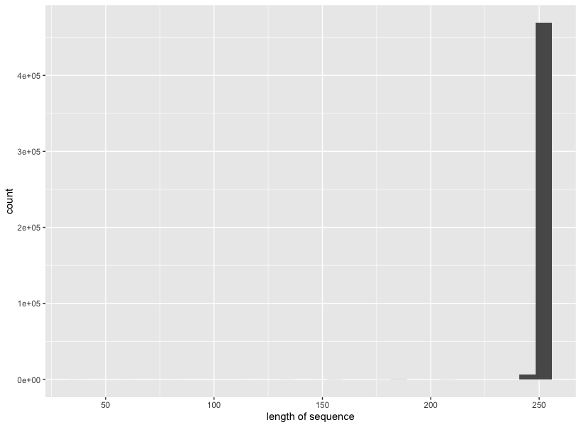
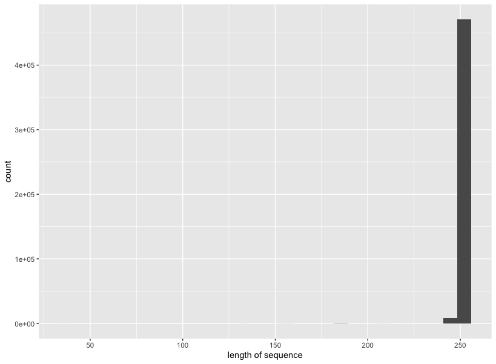
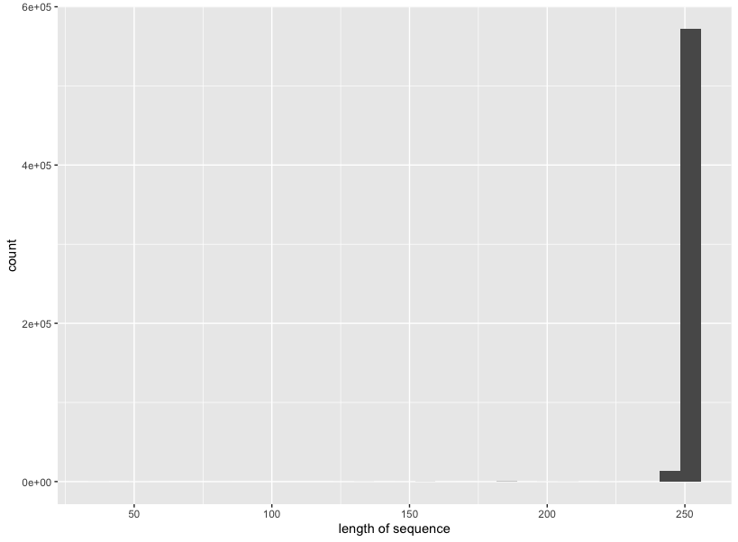
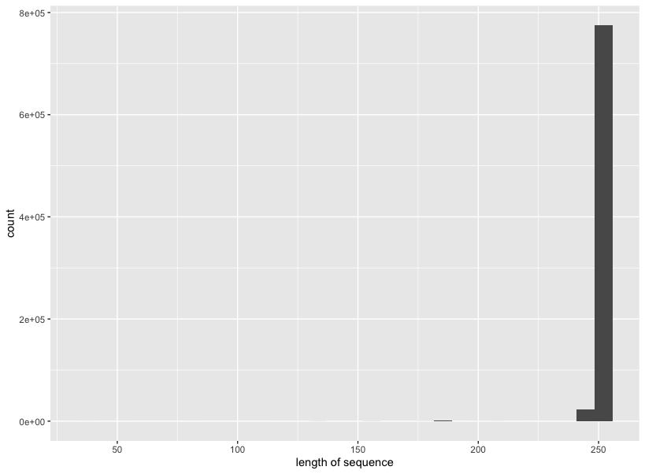
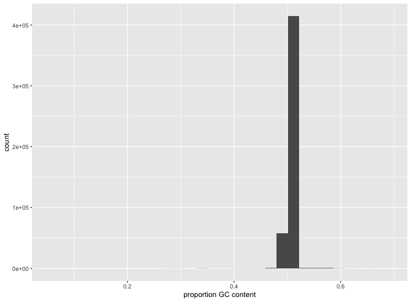
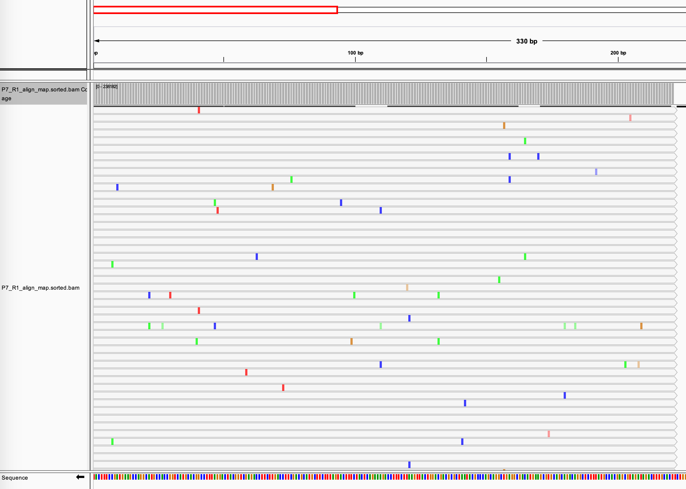
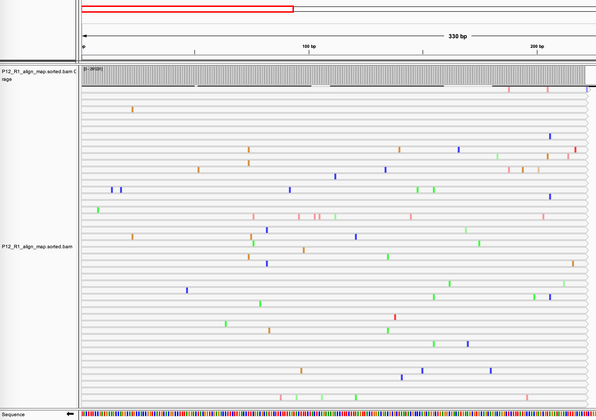
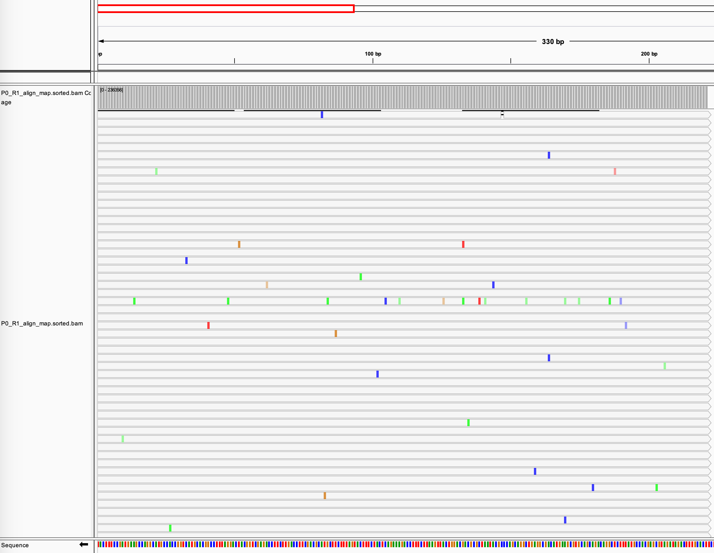
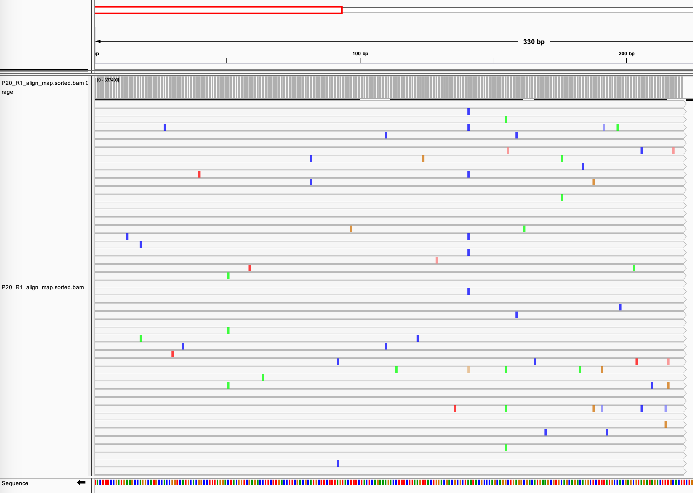

# EE282 Final Project
Ria Deshpande  \
December 16, 2020

### Introduction

Tryptophan synthetase is an enzyme that is part of the tryptophan synthesis pathway, and is responsible for catalysing the final two steps of the biosynthesis reaction. TrpB is the gene responsible for encoding the beta chain of tryptophan synthetase in many species of bacteria. In our mutation accumulation experiment, the trpB gene is encoded onto p1, with an error prone polymerase and mutations are allowed to accumulate over time on this gene. The error prone polymerase has a mutation rate that is over 10,000 times that of the genomic mutation rate. The passaging of the yeast is done in a tryptophan deficient medium, such that trpB on p1 is the only location of that gene. Thus, to survive, it is important that this trpB still remains functional. A part of the TrpB gene has been amplified by PCR, and sequenced using AmpliconEZ sequencing. The results from different passages, denoting time are shown below. The passages being considered are: P0, P7, P12, and P20.

### Methods

Fastq files were acquired, and the md5sum was used to confirm the integrity of all the files. Basic details of the files are analyzed: total number of reads sequenced, total number of N's in the reads, and the total GC content per read. However, since the files are in fastq format, they need to first be converted to fasta sequences.The lengths can be plotted to see if a significant number were terminated early during sequencing. We can calculate the average number of N's per read by dividing the total length of the sequences by the total number of N's. For P0: 0.9998, P7: 0.9996, P12: 0.9995, P20: 0.9996. We can also calculate the %GC content to see if our system is biased in a way that cause mutations to be disproportionately GC instead of AT. The next step in the exploratory data analysis pipeline is to align the reads to the reference sequence, and convert them to a format that will make it easy to read, and identify mutations that have accumulated over time. We use Burrows-Wheeler Alignment (BWA) to align the sequences to the reference and then convert the fastq files to sam and bam formats. The bam files can be easily viewed on IGV, and location and distribution of mutations can be identified.

#### Code

Verify file integrity + count number of reads per sequencing reaction
``` bash
md5sum -c md5sum_list.txt
bioawk -c fastx '{print ">"$name"\n"$seq}' ~/Project/zippedReads/P0_R1_001.fastq.gz > ~/Project/zippedReads/P0_R1.fasta
bioawk -c fastx '{print ">"$name"\n"$seq}' ~/Project/zippedReads/P7_R1_001.fastq.gz > ~/Project/zippedReads/P7_R1.fasta
bioawk -c fastx '{print ">"$name"\n"$seq}' ~/Project/zippedReads/P12_R1_001.fastq.gz > ~/Project/zippedReads/P12_R1.fasta
bioawk -c fastx '{print ">"$name"\n"$seq}' ~/Project/zippedReads/P20_R1_001.fastq.gz > ~/Project/zippedReads/P20_R1.fasta

faSize -detailed ~/Project/zippedReads/P0_R1.fasta > ~/Project/zippedReads/P0_R1.txt
faSize -detailed ~/Project/zippedReads/P7_R1.fasta > ~/Project/zippedReads/P7_R1.txt
faSize -detailed ~/Project/zippedReads/P12_R1.fasta > ~/Project/zippedReads/P12_R1.txt
faSize -detailed ~/Project/zippedReads/P20_R1.fasta > ~/Project/zippedReads/P20_R1.txt  

wc -l ~/Project/zippedReads/P0_R1.txt  # 476090
wc -l ~/Project/zippedReads/P7_R1.txt  # 479769
wc -l ~/Project/zippedReads/P12_R1.txt # 585617
wc -l ~/Project/zippedReads/P20_R1.txt # 798756
```
Plotting lengths
``` R
library(ggplot2)
a <- ggplot(data = P0_R1)
a + geom_histogram(mapping = aes(x=V2)) + xlab('length of sequence')

library(ggplot2)
b <- ggplot(data = P7_R1)
b + geom_histogram(mapping = aes(x=V2)) + xlab('length of sequence')

library(ggplot2)
c <- ggplot(data = P12_R1)
c + geom_histogram(mapping = aes(x=V2)) + xlab('length of sequence')

library(ggplot2)
d <- ggplot(data = P20_R1)
d + geom_histogram(mapping = aes(x=V2)) + xlab('length of sequence')
```
Calculating the total number of N's
``` bash
bioawk -c fastx 'length($seq) > 100 { print ">"$name; print $seq }' ~/Project/zippedReads/P0_R1.fasta > ~/Project/zippedReads/P0_R1_001_length.fasta
grep -o 'N' ~/Project/zippedReads/P0_R1_001_length.fasta  | wc -l
# 476164

bioawk -c fastx 'length($seq) > 100 { print ">"$name; print $seq }' ~/Project/zippedReads/P7_R1.fasta > ~/Project/zippedReads/P7_R1_001_length.fasta
grep -o 'N' ~/Project/zippedReads/P7_R1_001_length.fasta  | wc -l
# 479951

bioawk -c fastx 'length($seq) > 100 { print ">"$name; print $seq }' ~/Project/zippedReads/P12_R1.fasta > ~/Project/zippedReads/P12_R1_001_length.fasta
grep -o 'N' ~/Project/zippedReads/P12_R1_001_length.fasta  | wc -l
# 585878

bioawk -c fastx 'length($seq) > 100 { print ">"$name; print $seq }' ~/Project/zippedReads/P20_R1.fasta > ~/Project/zippedReads/P20_R1_001_length.fasta
grep -o 'N' ~/Project/zippedReads/P20_R1_001_length.fasta  | wc -l
# 799072
```
Calculate the GC content per time point
``` bash
bioawk -c fastx '{ print $name, gc($seq) }' P0_R1_001_length.fasta > P0_R1_gc.txt
bioawk -c fastx '{ print $name, gc($seq) }' P0_R1_001_length.fasta > P7_R1_gc.txt
bioawk -c fastx '{ print $name, gc($seq) }' P0_R1_001_length.fasta > P12_R1_gc.txt
bioawk -c fastx '{ print $name, gc($seq) }' P0_R1_001_length.fasta > P20_R1_gc.txt
```
Plot GC content using R
``` R
library(ggplot2)
e <- ggplot(data = P0_R1_gc)
e + geom_histogram(mapping = aes(x=V2)) + xlab('proportion GC content')

library(ggplot2)
f <- ggplot(data = P7_R1_gc)
f + geom_histogram(mapping = aes(x=V2)) + xlab('proportion GC content')

library(ggplot2)
g <- ggplot(data = P12_R1_gc)
g + geom_histogram(mapping = aes(x=V2)) + xlab('proportion GC content')

library(ggplot2)
h <- ggplot(data = P20_R1_gc)
h + geom_histogram(mapping = aes(x=V2)) + xlab('proportion GC content')
```
BWA alignment, samtools, and bedtools
``` bash
# With help from http://userweb.eng.gla.ac.uk/umer.ijaz/bioinformatics/BWA_tutorial.pdf
conda install bwa
bwa index ReferenceSeqs.fasta
bwa mem ReferenceSeqs.fasta ~/Project/zippedReads/P0_R1_001.fastq.gz  > P0_R1_align.sam
bwa mem ReferenceSeqs.fasta ~/Project/zippedReads/P7_R1_001.fastq.gz  > P7_R1_align.sam
bwa mem ReferenceSeqs.fasta ~/Project/zippedReads/P12_R1_001.fastq.gz  > P12_R1_align.sam
bwa mem ReferenceSeqs.fasta ~/Project/zippedReads/P20_R1_001.fastq.gz  > P20_R1_align.sam
bwa mem ReferenceSeqs.fasta ~/Project/zippedReads/ReferenceSeqs.fasta > ReferenceSeqs.sam

conda install -c bioconda samtools=1.9 --force-reinstall
samtools view -h -b -S P0_R1_align.sam > P0_R1_align.bam
samtools view -h -b -S P7_R1_align.sam > P7_R1_align.bam
samtools view -h -b -S P12_R1_align.sam > P12_R1_align.bam
samtools view -h -b -S P20_R1_align.sam > P20_R1_align.bam
samtools view -h -b -S ReferenceSeqs.sam > ReferenceSeqs.bam

samtools view -b -F 4 P0_R1_align.bam > P0_R1_align_map.bam
samtools view -b -F 4 P7_R1_align.bam > P7_R1_align_map.bam
samtools view -b -F 4 P12_R1_align.bam > P12_R1_align_map.bam
samtools view -b -F 4 P20_R1_align.bam > P20_R1_align_map.bam

samtools view -H P0_R1_align_map.bam | perl -ne 'if ($_ =~ m/^\@SQ/)
{ print $_ }' | perl -ne 'if ($_ =~ m/SN:(.+)\s+LN:(\d+)/) { print $1, "\t", $2, "\n"}' > P0_R1_lengths.genome
samtools view -H P0_R1_align_map.bam | perl -ne 'if ($_ =~ m/^\@SQ/)
{ print $_ }' | perl -ne 'if ($_ =~ m/SN:(.+)\s+LN:(\d+)/) { print $1, "\t", $2, "\n"}' > P7_R1_lengths.genome
samtools view -H P0_R1_align_map.bam | perl -ne 'if ($_ =~ m/^\@SQ/)
{ print $_ }' | perl -ne 'if ($_ =~ m/SN:(.+)\s+LN:(\d+)/) { print $1, "\t", $2, "\n"}' > P12_R1_lengths.genome
samtools view -H P0_R1_align_map.bam | perl -ne 'if ($_ =~ m/^\@SQ/)
{ print $_ }' | perl -ne 'if ($_ =~ m/SN:(.+)\s+LN:(\d+)/) { print $1, "\t", $2, "\n"}' > P20_R1_lengths.genome

samtools sort -m 1000000000 P0_R1_align_map.bam -o P0_R1_align_map.sorted.bam
samtools sort -m 1000000000 P7_R1_align_map.bam -o P7_R1_align_map.sorted.bam
samtools sort -m 1000000000 P12_R1_align_map.bam -o P12_R1_align_map.sorted.bam
samtools sort -m 1000000000 P20_R1_align_map.bam -o P20_R1_align_map.sorted.bam

samtools index P0_R1_align_map.sorted.bam P0_R1_align_map.sorted.bam.bai
samtools index P7_R1_align_map.sorted.bam P7_R1_align_map.sorted.bam.bai
samtools index P12_R1_align_map.sorted.bam P12_R1_align_map.sorted.bam.bai
samtools index P20_R1_align_map.sorted.bam P20_R1_align_map.sorted.bam.bai

bedtools genomecov -ibam P0_R1_align_map.sorted.bam -d -g P0_R1_lengths.genome > P0_R1_alignmap.bam.perbase.cov
bedtools genomecov -ibam P0_R1_align_map.sorted.bam -d -g P7_R1_lengths.genome > P7_R1_alignmap.bam.perbase.cov
bedtools genomecov -ibam P0_R1_align_map.sorted.bam -d -g P12_R1_lengths.genome > P12_R1_alignmap.bam.perbase.cov
bedtools genomecov -ibam P0_R1_align_map.sorted.bam -d -g P20_R1_lengths.genome > P20_R1_alignmap.bam.perbase.cov

awk -F"\t" '$3>0{print $1}' P0_R1_alignmap.bam.perbase.cov | sort |
uniq -c > P0_R1_alignmap.bam.perbase.count
awk -F"\t" '$3>0{print $1}' P7_R1_alignmap.bam.perbase.cov | sort |
uniq -c > P7_R1_alignmap.bam.perbase.count
awk -F"\t" '$3>0{print $1}' P12_R1_alignmap.bam.perbase.cov | sort |
uniq -c > P12_R1_alignmap.bam.perbase.count
awk -F"\t" '$3>0{print $1}' P20_R1_alignmap.bam.perbase.cov | sort |
uniq -c > P20_R1_alignmap.bam.perbase.count
```
### Results
We can analyze the length of sequences, to ensure that most of them are full length and are not prematurely truncated. The histograms below show that most of the sequences are the required 250 bp length, but as the number of sequencing reads increase, there is a slight increase in sequences that are 249 bp in length. However, the results show that there is not a dramatic increase in short sequences over time.

|Passage 0|Passage 7|
|--------------|--------------|
|||
|Passage 12 | Passage 20|
|||

The histograms showing proportion of GC content do not show any major changes over time. Most of the sequences show about 50% GC content, which does not appear to change as there is an increase in the number of passages.

|Passage 0|Passage 7|
|--------------|--------------|
|||
|Passage 12 | Passage 20|
|||

The four windows below shows what the alignment of each time point looks like when viewed using the Integrative Genomic Viewer. The reference sequence is the wild type sequence, and the first 250 bases are aligned over all the reads at each time point. Every row is an individual read, and the colored lines identify the bases that are different than the reference. The blue line denotes base change to a C, green denotes change to an A, red denotes change to a T and the yellow-brown color denotes change to a G. Additonally, the faded out bands correspond to a low quality score of the respective base change. The best quality reads which assembled at the top are seen here. Counting the number of mutations visible on the screen, we see that the number of mutations increases from passage 0 to passage 7, reduces slightly to passage 12, but the number of mutations increases again by passage 20.

|Passage 0|Passage 7|
|--------------|--------------|
|||
|Passage 12 | Passage 20|
|||


### Discussion

OrthoRep, will introduce mutations in the trpB gene over time. Identifying the proportion of GC content will allow us to determine if OrthoRep inherently has a GC bias, which would show an increased GC content over time as mutations start to accumulate. Since the histograms below do not show a significant increase or decrease in GC content over time, we can say that OrthoRep is not biased. Similarly, no truncation of sequencing reaction occurs and length of sequencing reads remains stable at 250 bp.

In a mutation accumulation experiment, in the first few passages, the diversity of  utations is very high as most single mutations in the sequence get sampled. Of these, the ones that inactivate the proteins cannot be sustained and get wiped out over time. However, the mutations that improve function or are responsible for altered function continue to persist, and start sweeping the small cultures that they are growing in, and are thus found in larger and larger proportions of the sequencing reads. This is similar to the results seen in the IGV sequencing reads. For Passage 0, the number of mutations is low and there are few mutations that are found on a large number of reads. In comparison, At passage 20, the number of mutations is larger than those at passage 0, but a bunch of them are found on a large number of reads showing that they probably arose earlier during evolution, and also that they are responsible for enhanced or altered function as per the selection. Some of the these persistent mutations are found in Passage 7 and Passage 12. Since directed evolution in the process of mutation accumulated allows for exploration of an almost infinite sequence space, a number of mutations both individually and in groups can be tested.

The next steps of this analysis would be to find the most overrepresented mutations, locate them on the crystal structure, as do more experimetns do check for altered phenotype or activity.
